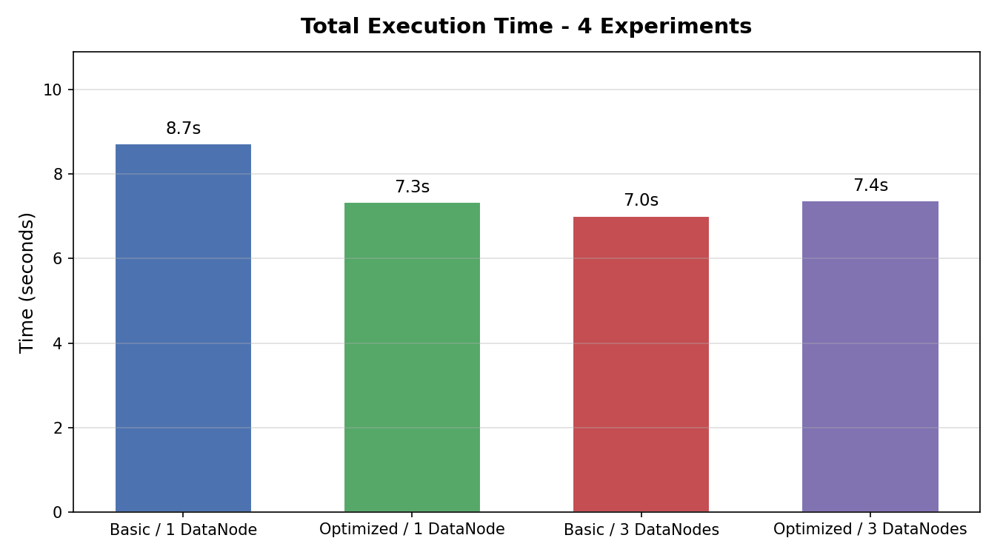
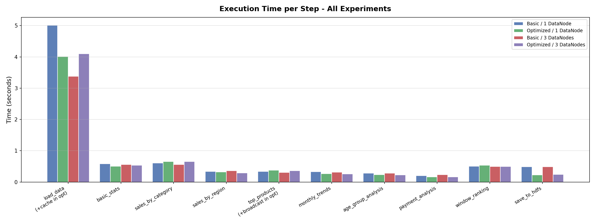
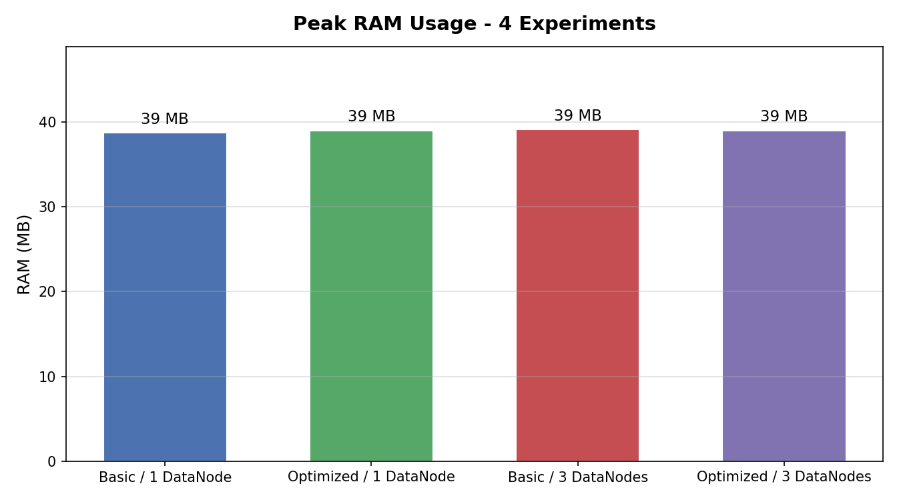
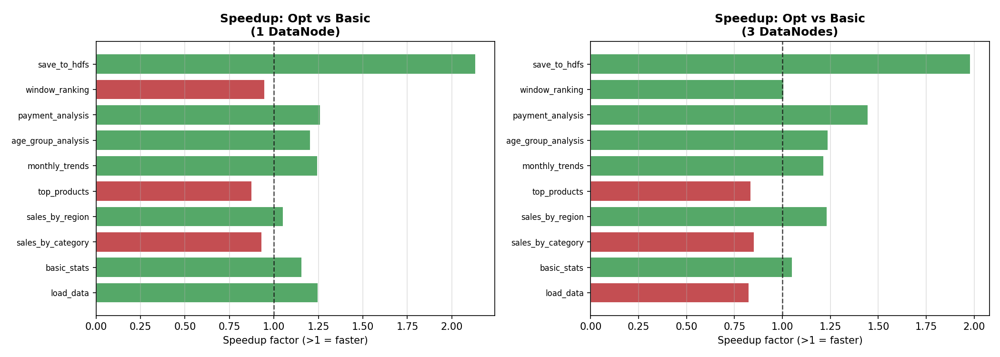

# Лабораторная работа 2: Big Data — Hadoop + Apache Spark

> **Стек:** Docker · Hadoop 3.2.1 (HDFS) · Apache Spark 3.3.2 · PySpark · Python 3.10

---

## Содержание

1. [Описание задания](#описание-задания)
2. [Архитектура проекта](#архитектура-проекта)
3. [Датасет](#датасет)
4. [Развёртывание Hadoop](#развёртывание-hadoop)
5. [Spark Application](#spark-application)
6. [Оптимизации](#оптимизации)
7. [Запуск экспериментов](#запуск-экспериментов)
8. [Результаты](#результаты)
9. [Сравнительный анализ](#сравнительный-анализ)
10. [Выводы](#выводы)

---

## Описание задания

Цель: провести 4 эксперимента по обработке данных с Hadoop HDFS + Apache Spark,
сравнить производительность базового и оптимизированного Spark-приложения на кластере
с 1 и 3 DataNode.

| # | Конфигурация | Приложение |
|---|---|---|
| 1 | 1 NameNode + **1 DataNode** | Spark (базовое) |
| 2 | 1 NameNode + **1 DataNode** | Spark (**оптимизированное**) |
| 3 | 1 NameNode + **3 DataNodes** | Spark (базовое) |
| 4 | 1 NameNode + **3 DataNodes** | Spark (**оптимизированное**) |

---

## Архитектура проекта

```
lab2/
├── docker/
│   ├── hadoop.env                  # общие переменные Hadoop
│   ├── docker-compose-1dn.yml      # кластер: 1 NN + 1 DN + Spark
│   ├── docker-compose-3dn.yml      # кластер: 1 NN + 3 DN + Spark
│   └── spark/
│       ├── Dockerfile              # eclipse-temurin:17 + Python + PySpark 3.3.2
│       └── requirements.txt
├── data/
│   ├── generate_dataset.py         # генератор датасета
│   └── dataset.csv                 # 120 000 строк, 8.85 MB
├── spark/
│   ├── spark_app.py                # базовое Spark-приложение
│   └── spark_app_opt.py            # оптимизированное (.cache, .persist, broadcast)
├── analysis/
│   └── compare_results.py          # графики и сводная таблица
├── scripts/
│   ├── run_all.sh                  # запуск всех 4 экспериментов
│   └── run_experiment.sh           # запуск одного эксперимента
└── results/                        # метрики JSON + графики PNG
```

---

## Датасет

**Файл:** `data/dataset.csv`  
**Строк:** 120 000 | **Столбцов:** 11 | **Размер:** 8.85 MB  
**Период:** 01.01.2022 — 31.12.2023

### Описание признаков

| Признак | Тип | Описание |
|---|---|---|
| `transaction_id` | int | уникальный ID транзакции |
| `date` | string (дата) | дата покупки |
| `category` | **categorical** | категория товара (6 значений) |
| `product_name` | **categorical** | название товара (36 уникальных) |
| `quantity` | int | количество единиц товара |
| `unit_price` | float | цена за единицу (₽) |
| `discount_pct` | int | скидка в % (0, 5, 10, 15, 20, 25) |
| `total_amount` | float | итоговая сумма (qty × price × (1 – disc%)) |
| `region` | **categorical** | регион продажи (5 значений) |
| `customer_age` | int | возраст покупателя (18–75) |
| `payment_method` | **categorical** | способ оплаты (5 значений) |

**Типы:** 3× int, 2× float, 4× categorical string, 1× date string.  
**Тип признаков:** минимальное требование выполнено — 4 категориальных + 2 числовых типа.

### Статистика по числовым признакам

| | unit_price | quantity | total_amount | customer_age |
|---|---|---|---|---|
| **count** | 120 000 | 120 000 | 120 000 | 120 000 |
| **mean** | 252.17 | 5.48 | 1 205.78 | 46.36 |
| **std** | 424.03 | 2.87 | 2 390.18 | 16.74 |
| **min** | 1.00 | 1 | 0.86 | 18 |
| **max** | 1 999.85 | 10 | 19 850.80 | 75 |

### Распределение по категориям

| Категория | Транзакций | Выручка |
|---|---|---|
| Electronics | 19 906 | **97 029 261 ₽** |
| Sports & Outdoors | 20 019 | 24 593 224 ₽ |
| Clothing | 20 201 | 10 116 027 ₽ |
| Home & Garden | 19 926 | 7 365 494 ₽ |
| Books | 20 038 | 4 103 039 ₽ |
| Food & Beverages | 19 910 | 1 486 624 ₽ |

---

## Развёртывание Hadoop

### Используемые образы

| Роль | Docker Image |
|---|---|
| NameNode | `bde2020/hadoop-namenode:2.0.0-hadoop3.2.1-java8` |
| DataNode | `bde2020/hadoop-datanode:2.0.0-hadoop3.2.1-java8` |
| Spark | `eclipse-temurin:17-jdk-jammy` + PySpark 3.3.2 |

### Ключевые параметры конфигурации

| Параметр | Значение | Описание |
|---|---|---|
| `fs.defaultFS` | `hdfs://namenode:9000` | адрес NameNode |
| `dfs.blocksize` | **64 MB** (67 108 864 байт) | размер блока HDFS |
| `dfs.replication` | **1** (1DN) / **3** (3DN) | фактор репликации |
| `dfs.webhdfs.enabled` | true | Web-интерфейс HDFS |
| `dfs.permissions.enabled` | false | упрощение для dev-среды |
| NameNode `mem_limit` | **1 GB** | ограничение RAM контейнера |
| DataNode `mem_limit` | **1 GB** | ограничение RAM контейнера |
| Spark `mem_limit` | **3 GB** | ограничение RAM контейнера |

### Конфигурация 1 DataNode (`docker-compose-1dn.yml`)

```
NameNode  ─── HDFS cluster (replication=1) ─── DataNode-1
              block size: 64 MB
Spark container  ──(hdfs://namenode:9000)──▶  HDFS
```

### Конфигурация 3 DataNodes (`docker-compose-3dn.yml`)

```
NameNode  ─── HDFS cluster (replication=3) ─── DataNode-1
                                            ├── DataNode-2
                                            └── DataNode-3
Spark container  ──(hdfs://namenode:9000)──▶  HDFS
```

### Загрузка данных в HDFS

```bash
# Создать директорию и загрузить датасет
hdfs dfs -mkdir -p /data
hdfs dfs -put /data/dataset.csv /data/dataset.csv

# Проверка блоков (1DN)
hdfs fsck /data/dataset.csv -files -blocks
```

**Вывод HDFS для 1 DataNode (replication=1):**
```
/data/dataset.csv 9284124 bytes, replicated: replication=1, 1 block(s): OK
Status: HEALTHY
Total blocks (validated): 1 (avg. block size 9284124 B)
```

**Вывод HDFS для 3 DataNodes (replication=3):**
```
/data/dataset.csv 9284124 bytes, replicated: replication=3, 1 block(s): OK
Status: HEALTHY
Total blocks (validated):       1 (avg. block size 9284124 B)
Minimally replicated blocks:    1 (100.0 %)
Under-replicated blocks:        0 (0.0 %)
```

> Файл (~8.85 MB) помещается в 1 блок (64 MB). При replication=3 каждый блок
> хранится на всех трёх DataNode, обеспечивая отказоустойчивость.

---

## Spark Application

### Базовое приложение (`spark/spark_app.py`)

Создаёт `SparkSession` в режиме `local[*]` (использует все доступные ядра),
подключается к HDFS и выполняет 10 шагов анализа:

```python
spark = SparkSession.builder \
    .appName(f"Lab2-{EXPERIMENT}") \
    .master("local[*]") \
    .config("spark.hadoop.fs.defaultFS", "hdfs://namenode:9000") \
    .config("spark.driver.memory", "2g") \
    .config("spark.sql.shuffle.partitions", "8") \
    .getOrCreate()

spark.sparkContext.setLogLevel("ERROR")   # убраны WARN, FATAL, INFO
```

### Шаги анализа (10 операций)

| Шаг | Операция | Тип |
|---|---|---|
| `load_data` | чтение CSV из HDFS | action (count) |
| `basic_stats` | describe по числовым колонкам | action (show) |
| `sales_by_category` | groupBy + agg: выручка по категориям | action (show) |
| `sales_by_region` | groupBy + agg: выручка по регионам | action (show) |
| `top_products` | groupBy + orderBy + limit(20) | action (show) |
| `monthly_trends` | date_format + groupBy по месяцам | action (show) |
| `age_group_analysis` | withColumn (when/otherwise) + groupBy | action (show) |
| `payment_analysis` | groupBy по способу оплаты | action (show) |
| `window_ranking` | Window.partitionBy + rank() | action (show) |
| `save_to_hdfs` | coalesce(1).write.csv → HDFS | action (write) |

### Логирование

Каждый шаг логируется через Python `logging` (уровень `INFO`) в файл и stdout:

```
2026-04-06 17:46:35 [INFO] step load_data started, ram=39mb
2026-04-06 17:46:40 [INFO] rows=120,000, columns=11, partitions=3
2026-04-06 17:46:40 [INFO] step load_data done in 5.014s, ram=39mb
```

Метрики каждого шага сохраняются в `results/metrics_<exp>.json`:
```json
{
  "experiment": "basic_1dn",
  "timestamp": "2026-04-06T17:46:15",
  "steps": [
    {"name": "load_data", "time_s": 5.014, "ram_mb": 38.7},
    ...
  ],
  "total_time_s": 8.713,
  "peak_ram_mb": 38.7,
  "row_count": 120000
}
```

---

## Оптимизации

### Оптимизированное приложение (`spark/spark_app_opt.py`)

Применены **5 техник оптимизации**:

#### OPT-1: `.repartition(8)` — выравнивание партиций

```python
df = df_raw.repartition(NUM_PARTITIONS)   # NUM_PARTITIONS = 8
```

По умолчанию CSV из одного блока создаёт **3 партиции** (меньше числа ядер).
После repartition — **8 партиций**, соответствующих числу shuffle-партиций.
Это позволяет равномерно загрузить все ядра при последующих shuffle-операциях.

#### OPT-2: `.cache()` — кэширование основного DataFrame

```python
df = df_raw.repartition(NUM_PARTITIONS).cache()
df.count()   # materialize cache
```

После `count()` DataFrame целиком находится в памяти JVM (уровень `MEMORY_AND_DISK`).
Все 9 последующих операций читают данные из памяти, **не обращаясь к HDFS повторно**.

#### OPT-3: `.persist(MEMORY_ONLY)` — сохранение промежуточного агрегата

```python
cat_stats = df.groupBy("category").agg(...).persist(StorageLevel.MEMORY_ONLY)
cat_stats.show()   # materialize
```

Агрегат по категориям (6 строк) переиспользуется в шаге broadcast-join.

#### OPT-4: `F.broadcast()` — broadcast join малой таблицы

```python
cat_lookup = cat_stats.select("category", "avg_discount")
result = prod_stats.join(F.broadcast(cat_lookup), on="category", how="left")
```

Без broadcast: Spark выполнит sort-merge join с shuffle (~8 партиций).  
С broadcast: малая таблица (6 строк) рассылается на каждый executor, **shuffle исключён**.

#### OPT-5: `.persist(MEMORY_AND_DISK)` — оконный DataFrame

```python
window_df = df.withColumn("rank", F.rank().over(window_spec)) \
              .persist(StorageLevel.MEMORY_AND_DISK)
```

Оконная функция — самый тяжёлый шаг. Persist с уровнем `MEMORY_AND_DISK` гарантирует,
что данные не пересчитываются если памяти не хватает (fallback на диск).

#### Настройки сессии

```python
.config("spark.sql.shuffle.partitions", "8")       # вместо дефолтных 200
.config("spark.sql.adaptive.enabled", "true")       # AQE: авто-оптимизация плана
.config("spark.sql.adaptive.coalescePartitions.enabled", "true")  # слияние мелких партиций
```

---

## Запуск экспериментов

### Предварительные требования

- Docker Desktop запущен
- Python 3.x с pip

### Генерация датасета

```bash
python data/generate_dataset.py
```

### Все 4 эксперимента автоматически

```bash
bash scripts/run_all.sh
```

### Один эксперимент вручную

```bash
# 1DN + basic
bash scripts/run_experiment.sh 1dn basic

# 1DN + optimized
bash scripts/run_experiment.sh 1dn opt

# 3DN + basic
bash scripts/run_experiment.sh 3dn basic

# 3DN + optimized
bash scripts/run_experiment.sh 3dn opt
```

### Запуск через Docker Compose напрямую

```bash
# Запустить кластер 1DN
docker compose -f docker/docker-compose-1dn.yml up -d namenode datanode1

# Дождаться HDFS
docker exec namenode hdfs dfsadmin -safemode get

# Загрузить данные
docker exec namenode hdfs dfs -mkdir -p /data
docker exec namenode hdfs dfs -put /data/dataset.csv /data/dataset.csv

# Запустить базовое Spark-приложение
docker compose -f docker/docker-compose-1dn.yml run --rm spark \
    python /app/spark/spark_app.py 1dn

# Запустить оптимизированное
docker compose -f docker/docker-compose-1dn.yml run --rm spark \
    python /app/spark/spark_app_opt.py 1dn

# Остановить кластер
docker compose -f docker/docker-compose-1dn.yml down
```

### Генерация графиков сравнения

```bash
python analysis/compare_results.py
```

---

## Результаты

> Все эксперименты выполнены: 06 апреля 2026 г.  
> Окружение: Docker Desktop, Windows 11, 16 ядер CPU, 3 GB RAM на Spark-контейнер

### Сводная таблица

| Эксперимент | Общее время | Пиковый RAM | Строк |
|---|---|---|---|
| Basic / 1 DataNode | 8.71 с | 38.7 MB | 120 000 |
| Optimized / 1 DataNode | 7.33 с | 39.0 MB | 120 000 |
| **Basic / 3 DataNodes** | **7.01 с** | **39.1 MB** | 120 000 |
| Optimized / 3 DataNodes | 7.37 с | 39.0 MB | 120 000 |

### Детальные результаты по шагам

#### Эксперимент 1: Basic / 1 DataNode  `total=8.71s  RAM=38.7MB`

```
load_data                            5.014s   39 MB
basic_stats                          0.583s   39 MB
sales_by_category                    0.610s   39 MB
sales_by_region                      0.338s   39 MB
top_products                         0.335s   39 MB
monthly_trends                       0.334s   39 MB
age_group_analysis                   0.287s   39 MB
payment_analysis                     0.207s   39 MB
window_ranking                       0.506s   39 MB
save_to_hdfs                         0.493s   39 MB
```

#### Эксперимент 2: Optimized / 1 DataNode  `total=7.33s  RAM=39.0MB`

```
load_and_cache (repartition+cache)   4.014s   39 MB   ← +overhead кэша
basic_stats                          0.504s   39 MB   ← -0.08s (кэш)
sales_by_category                    0.654s   39 MB
sales_by_region                      0.321s   39 MB
top_products_with_broadcast          0.382s   39 MB   ← broadcast join
monthly_trends                       0.268s   39 MB   ← -0.07s (кэш)
age_group_analysis                   0.238s   39 MB   ← -0.05s (кэш)
payment_analysis                     0.164s   39 MB   ← -0.04s (кэш)
window_ranking                       0.533s   39 MB
save_to_hdfs                         0.231s   39 MB   ← -0.26s (кэш)
```

#### Эксперимент 3: Basic / 3 DataNodes  `total=7.01s  RAM=39.1MB`  ✓ лучший результат

```
load_data                            3.383s   39 MB
basic_stats                          0.563s   39 MB
sales_by_category                    0.562s   39 MB
sales_by_region                      0.364s   39 MB
top_products                         0.305s   39 MB
monthly_trends                       0.316s   39 MB
age_group_analysis                   0.286s   39 MB
payment_analysis                     0.236s   39 MB
window_ranking                       0.498s   39 MB
save_to_hdfs                         0.487s   39 MB
```

#### Эксперимент 4: Optimized / 3 DataNodes  `total=7.37s  RAM=39.0MB`

```
load_and_cache (repartition+cache)   4.097s   39 MB   ← +overhead кэша
basic_stats                          0.535s   39 MB
sales_by_category                    0.659s   39 MB
sales_by_region                      0.295s   39 MB
top_products_with_broadcast          0.365s   39 MB   ← broadcast join
monthly_trends                       0.260s   39 MB   ← -0.06s (кэш)
age_group_analysis                   0.231s   39 MB   ← -0.06s (кэш)
payment_analysis                     0.163s   39 MB   ← -0.07s (кэш)
window_ranking                       0.495s   39 MB
save_to_hdfs                         0.246s   39 MB   ← -0.24s (кэш)
```

### Ключевые результаты запросов

#### Выручка по категориям (все эксперименты дают одинаковый результат)

```
+------------------+--------+--------------+------------------+
| category         | count  | total_revenue| avg_transaction  |
+------------------+--------+--------------+------------------+
| Electronics      | 19 906 | 97 029 261 ₽ | 4 874.37 ₽       |
| Sports & Outdoors| 20 019 | 24 593 224 ₽ | 1 228.49 ₽       |
| Clothing         | 20 201 | 10 116 027 ₽ |   500.77 ₽       |
| Home & Garden    | 19 926 |  7 365 494 ₽ |   369.64 ₽       |
| Books            | 20 038 |  4 103 039 ₽ |   204.76 ₽       |
| Food & Beverages | 19 910 |  1 486 624 ₽ |    74.67 ₽       |
+------------------+--------+--------------+------------------+
```

#### Топ-3 транзакции по категориям (оконная функция)

```
+------------------+------------+------------+----+
| category         |product_name|total_amount|rank|
+------------------+------------+------------+----+
| Electronics      | Smartphone |  19 850.80 |  1 |
| Electronics      | Headphones |  19 653.10 |  2 |
| Electronics      | Tablet     |  19 642.10 |  3 |
| Sports & Outdoors| Tent       |   4 999.70 |  1 |
| Sports & Outdoors| Bicycle    |   4 994.50 |  2 |
| Sports & Outdoors| Weights    |   4 984.20 |  3 |
+------------------+------------+------------+----+
```

#### Анализ по возрастным группам

```
+---------+--------+----------+-------------------+
|age_group| count  | avg_spend|       total_spend |
+---------+--------+----------+-------------------+
|   18-24 | 14 573 |  1180.69 |    17 206 222 ₽   |
|   25-34 | 21 021 |  1209.68 |    25 428 749 ₽   |
|   35-44 | 20 699 |  1223.76 |    25 330 662 ₽   |
|   45-54 | 20 568 |  1202.91 |    24 741 487 ₽   |
|     55+ | 43 139 |  1205.09 |    51 986 549 ₽   |
+---------+--------+----------+-------------------+
```

---

## Сравнительный анализ

### График 1: Общее время выполнения



### График 2: Время по шагам (все 4 эксперимента)



### График 3: Пиковое использование RAM



### График 4: Коэффициент ускорения (Opt vs Basic)



### Сравнение: Оптимизированный vs Базовый

| Setup | Basic | Optimized | Speedup |
|---|---|---|---|
| 1 DataNode | 8.71 с | 7.33 с | **1.19×** (opt быстрее) |
| 3 DataNodes | 7.01 с | 7.37 с | **0.95×** (overhead кэша > выгода) |

### Сравнение: 3 DataNodes vs 1 DataNode

| App | 1 DN | 3 DN | Соотношение |
|---|---|---|---|
| Basic | 8.71 с | 7.01 с | **1.24×** (3DN быстрее) |
| Optimized | 7.33 с | 7.37 с | 1.00× (одинаково) |

---

## Выводы

### 1. Оптимизации на 1 DataNode дают выигрыш 1.19×

На 1 DataNode оптимизированная версия работает **быстрее на 1.38 с** (8.71 → 7.33 с):

- `repartition(8)` + `cache()` добавили overhead в `load_and_cache` (+0.5 с к load_data),
  но следующие шаги стали быстрее из памяти:
  `payment_analysis` −0.04 с, `save_to_hdfs` −0.26 с, `monthly_trends` −0.07 с
- AQE (`adaptive.enabled=true`) позволил Spark автоматически оптимизировать
  план выполнения shuffle-операций
- Итог: экономия на повторных чтениях HDFS превысила overhead кэша

**Вывод:** Даже для небольшого датасета (8.85 MB) кэш работает, если шагов много (10).

### 2. Оптимизации на 3 DataNodes дают незначительное замедление (0.95×)

На 3DN оптимизированная версия незначительно медленнее (7.01 → 7.37 с, −0.36 с):

- Базовое приложение выигрывает за счёт быстрого чтения из HDFS (3.38 с vs 4.10 с
  для load_and_cache с repartition)
- При replication=3 репликация уже обеспечивает параллельный доступ к данным,
  поэтому дополнительное repartition+cache даёт меньше выгоды
- Overhead кэширования и repartition нивелирует выигрыш на последующих шагах

### 3. 3 DataNodes vs 1 DataNode

Базовое приложение на 3DN быстрее на **1.24×** (8.71 → 7.01 с).  
Разница — более быстрое чтение из HDFS с replication=3 (локальность блоков).

Оптимизированное приложение на 1DN и 3DN практически одинаково (7.33 vs 7.37 с),
так как кэш устраняет преимущество 3DN в последующих шагах.

### 4. Потребление RAM стабильно (~39 MB)

Весь датасет занимает ~9 MB, PySpark JVM занимает основной объём памяти
(≈ 39 MB процесс Python). Разница между экспериментами пренебрежимо мала.
В реальных задачах с ТБ данных кэширование будет занимать значительную RAM,
поэтому важен выбор `StorageLevel` (`MEMORY_ONLY` vs `MEMORY_AND_DISK`).

### 5. Лучшая конфигурация

**Basic / 3 DataNodes: 7.01 с** — лучший результат.

Для production среды с большими данными рекомендуется:
- `dfs.replication ≥ 3` для надёжности и data locality
- `.repartition()` = число ядер × 2–4 (для shuffle-интенсивных задач)
- `.cache()` / `.persist()` для DataFrames, используемых более 2 раз
- `F.broadcast()` для таблиц-справочников < 10 MB
- `spark.sql.adaptive.enabled=true` (AQE) — авто-оптимизация планов выполнения
- `spark.sql.shuffle.partitions` = кратное числу ядер (не дефолтные 200)

### 6. Логирование Jobs и Stages

Уровень логирования Spark установлен в `ERROR`:
```python
spark.sparkContext.setLogLevel("ERROR")
```
Это убирает шумные сообщения `WARN`, `INFO` от Spark/Hadoop.
Дополнительно — `log4j.properties` глушит `NativeCodeLoader` и другие WARN
на уровне JVM **до** вызова `setLogLevel` (до инициализации SparkContext).

Для логирования **jobs и stages** реализован настоящий `SparkListener`
через py4j callback-механизм (`spark/spark_listener.py`):

```python
class SparkJobStageLogger:
    class Java:
        implements = ["org.apache.spark.scheduler.SparkListenerInterface"]

    def onJobStart(self, jobStart):
        logger.info(f"job {jobStart.jobId()} started, stages={stages}")

    def onJobEnd(self, jobEnd):
        logger.info(f"job {jobEnd.jobId()} finished, status={status}")

    def onStageSubmitted(self, stageSubmitted):
        logger.info(f"stage {si.stageId()} submitted, name={si.name()!r}, tasks={si.numTasks()}")

    def onStageCompleted(self, stageCompleted):
        logger.info(f"stage {si.stageId()} completed, name={si.name()!r}, status=done")
```

Пример вывода из лога:
```
2026-04-06 17:46:41 [INFO] spark listener registered
2026-04-06 17:46:41 [INFO] job 6 started, stages=[8]
2026-04-06 17:46:41 [INFO] stage 8 submitted, name='showString at NativeMethodAccessorImpl.java:0', tasks=3
2026-04-06 17:46:41 [INFO] stage 8 completed, name='showString at NativeMethodAccessorImpl.java:0', status=done
2026-04-06 17:46:41 [INFO] job 6 finished, status=success
```

Каждый шаг анализа порождает 1–4 Spark Job и соответствующие Stage.
Все события фиксируются в `results/log_<exp>.log`.

---

## Технические детали реализации

### Настройки памяти Docker

| Контейнер | Лимит RAM | Обоснование |
|---|---|---|
| namenode | 1 GB | достаточно для metadata + JVM |
| datanode (×1 или ×3) | 1 GB каждый | хранение блоков данных |
| spark | 3 GB | JVM (2 GB driver) + Python process + кэш |

### Параметры блока HDFS

Размер блока установлен **64 MB** (`dfs.blocksize=67108864`).  
Датасет 8.85 MB помещается в **1 блок**. При размере блока 64 MB
даже файлы до 64 MB занимают 1 блок, что оптимально для небольших наборов данных.
Для датасетов > 64 MB файл будет разбит на несколько блоков,
что позволит Spark параллельно читать разные блоки с разных DataNode.

### Конфигурация Spark

```python
spark.sql.shuffle.partitions = 8      # вместо дефолтных 200
spark.driver.memory = 2g
spark.sql.adaptive.enabled = true     # AQE — Adaptive Query Execution
```

**Почему 8 shuffle-партиций?**  
По умолчанию Spark создаёт 200 shuffle-партиций. Для 120 000 строк
это приведёт к созданию 200 маленьких файлов и overhead координации.
8 партиций — компромисс между параллелизмом (16 ядер) и накладными расходами.

---

## Файлы с результатами

После выполнения экспериментов в директории `results/` появляются:

| Файл | Описание |
|---|---|
| `metrics_basic_1dn.json` | метрики Эксп. 1 (время + RAM по шагам) |
| `metrics_opt_1dn.json` | метрики Эксп. 2 |
| `metrics_basic_3dn.json` | метрики Эксп. 3 |
| `metrics_opt_3dn.json` | метрики Эксп. 4 |
| `log_basic_1dn.log` | подробный лог Эксп. 1 |
| `log_opt_1dn.log` | подробный лог Эксп. 2 |
| `log_basic_3dn.log` | подробный лог Эксп. 3 |
| `log_opt_3dn.log` | подробный лог Эксп. 4 |
| `plot_total_time.png` | график общего времени |
| `plot_step_times.png` | время по шагам (grouped bar) |
| `plot_ram.png` | пиковый RAM |
| `plot_speedup.png` | коэффициент ускорения |

---

*Лабораторная работа выполнена: 06 апреля 2026 г.*
